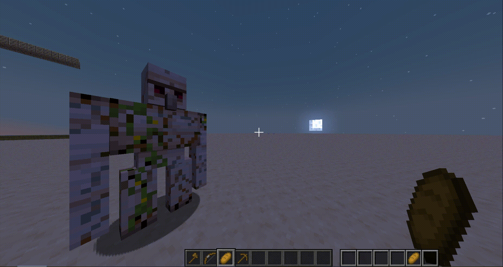

# + Crosshair Target Mod

Change your crosshair depending on the context of the situation.

| **cross type** | **description**                         |
|----------------|-----------------------------------------|
| idle           | default vanilla crosshair               |
| bow pull       | displays bow progress + scope           |
| use item       | displays use progress                   |
| target entity  | displays entity reach + attack progress |
| break block    | displays block break progress           |

### Target Entity
- blue line is your distance to target
- white line is your max reach distance

### Bow Pull
- the closer the red outer lines are to the center, the longer the range it will shot
- smaller white lines represent distance
- smaller red lines represent pull progress

### Use Item
- green shade represents use progress

### Break Block
- white shae represents break progress

Thanks for downloading, have a great one!

